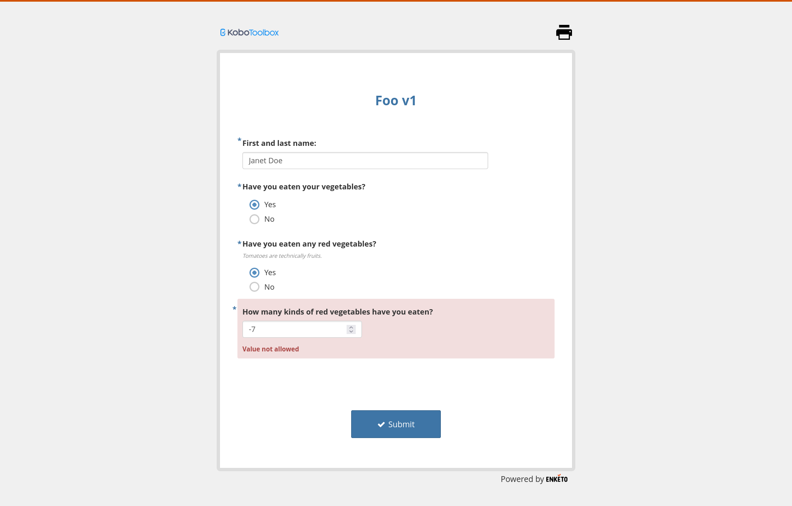

# Kidadisi: building XLSForm surveys

Kidadisi is an R package to build survey definitions and use those definitions to generate [XLSForm](https://xlsform.org/) questionnaires.
XLSForm is a portable format that is understood by both [SurveyCTO](https://www.surveycto.com/) and [KoboToolbox](https://www.kobotoolbox.org/).
The goal of this package is to make it easier to specify and edit surveys and track them in a version control system.

The spiritual predecessor of this package is [Honeybee](https://github.com/gn0/honeybee/) which transpiled survey definitions, written in a domain-specific language, into XLSForm.
Unlike Honeybee, Kidadisi aims to work with tooling such as [RStudio](https://posit.co/products/open-source/rstudio/) which research teams may already be familiar with.
However, Kidadisi works in any R environment and by no means requires RStudio.

## Table of contents

1. [How to install](#how-to-install)
2. [Example](#example)
3. [Useful resources](#useful-resources)

## How to install

Open the R console and enter the following:

```r
install.packages("devtools")
devtools::install_git(url = "https://codeberg.org/gnyeki/kidadisi/")
```

## Example

```r
form_definition <- Survey(
  form_id = foo_v1,
  form_version = auto,
  form_title = "Foo v1",
  ChoiceList(
    yes_no,
    Choice(1, "Yes"),
    Choice(0, "No")
  ),
  Ask(name, Text(), "First and last name:"),
  Ask(
    vegetables,
    SelectOne(yes_no),
    "Have you eaten your vegetables?"
  ),
  If(
    vegetables == 1,
    c(
      Ask(
        vegetables_red,
        SelectOne(yes_no),
        "Have you eaten any red vegetables?",
        hint = "Tomatoes are technically fruits."
      ),
      If(
        vegetables_red == 1,
        Ask(
            vegetables_red_count,
            Integer(),
            "How many kinds of red vegetables have you eaten?",
            constraint = . > 0 & . < 100
        )
      )
    )
  )
)

form_definition |> write_xlsform("foo_v1.xlsx")
```

The resulting survey will render like this with KoboToolbox:



The output file, `foo_v1.xlsx`, will contain the following.
In the `survey` worksheet:

| name                 | type              | label                                            | required | hint                             | relevance                                         | constraint          |
|----------------------|-------------------|--------------------------------------------------|----------|----------------------------------|---------------------------------------------------|---------------------|
| name                 | text              | First and last name:                             | yes      |                                  |                                                   |                     |
| vegetables           | select_one yes_no | Have you eaten your vegetables?                  | yes      |                                  |                                                   |                     |
| vegetables_red       | select_one yes_no | Have you eaten any red vegetables?               | yes      | Tomatoes are technically fruits. | `${vegetables} = 1`                               |                     |
| vegetables_red_count | integer           | How many kinds of red vegetables have you eaten? | yes      |                                  | `(${vegetables} = 1) and (${vegetables_red} = 1)` | `. > 0 and . < 100` |

In the `choices` worksheet:

| list_name | value | label |
|-----------|-------|-------|
| yes_no    | 1     | Yes   |
| yes_no    | 0     | No    |


In the `settings` worksheet:

| form_id | form_version | form_title |
|---------|--------------|------------|
| foo_v1  | 2309191945   | Foo v1     |

## Useful resources

KoboToolbox:

- [Custom Formatting in Web Forms](https://support.kobotoolbox.org/custom_format_web.html)
- [How to create a dropdown list in KoboToolbox as seen in Excel?](https://community.kobotoolbox.org/t/how-to-create-a-drop-down-list-in-kobotoolbox-as-seen-in-excel/943)

SurveyCTO:

- [Using expressions in your forms: a reference for all operators and functions](https://docs.surveycto.com/02-designing-forms/01-core-concepts/09.expressions.html)
- [Pre-loading data into a form](https://docs.surveycto.com/02-designing-forms/03-advanced-topics/03.preloading.html)
- [Loading multiple-choice options from pre-loaded data](https://docs.surveycto.com/02-designing-forms/03-advanced-topics/04.search-and-select.html)

